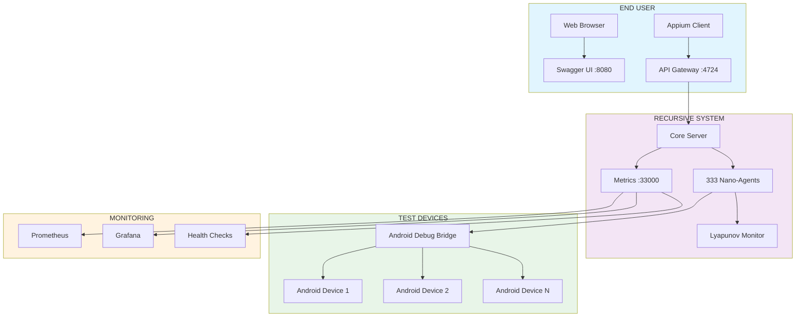

# RECURSIVE AUTONOMOUS SYSTEM v4.0
## User Manual & Installation Guide

<div align="center">

| Version | Release Date | Author | License |
|---------|--------------|--------|---------|
| 4.0.0 | March 14, 2026 | Dan Fernandez | MIT |

</div>

---

## TABLE OF CONTENTS
1. [System Overview](#system-overview)
2. [System Requirements](#system-requirements)
3. [Quick Installation](#quick-installation)
4. [Docker Deployment](#docker-deployment)
5. [Architectural Workflow](#architectural-workflow)
6. [First-Time Usage](#first-time-usage)
7. [API Documentation](#api-documentation)
8. [Monitoring & Metrics](#monitoring--metrics)
9. [Troubleshooting](#troubleshooting)
10. [What's Missing / Roadmap](#whats-missing--roadmap)
11. [Contact & Support](#contact--support)

---

## SYSTEM OVERVIEW

The **Recursive Autonomous System v4.0** is a quantum-inspired mobile automation platform featuring:

- **333 Ultra-Nano AI Agents** - Parallel processing swarm intelligence
- **Post-Quantum Security** - CRYSTALS-Kyber, Dilithium, Falcon, SPHINCS+
- **Full W3C WebDriver Protocol** - Compatible with Appium clients
- **Lyapunov Stability Control** - Mathematical proof of convergence
- **Predictive Anomaly Detection** - Anticipatory fault identification
- **Swagger UI Documentation** - Interactive API testing
- **Prometheus Metrics** - Real-time monitoring

**Total memory footprint:** <512KB  
**Collective intelligence:** >10M operations/cycle  
**Max concurrent clients:** 100,000+

---

## SYSTEM REQUIREMENTS

### Minimum Hardware
| Component | Requirement |
|-----------|-------------|
| **CPU** | 4 cores @ 2.0GHz |
| **RAM** | 4GB |
| **Storage** | 10GB free space |
| **Network** | 100Mbps |

### Recommended Hardware
| Component | Requirement |
|-----------|-------------|
| **CPU** | 8 cores @ 3.0GHz |
| **RAM** | 16GB |
| **Storage** | 50GB SSD |
| **Network** | 1Gbps |

### Software Requirements
| Software | Version |
|----------|---------|
| **Operating System** | Ubuntu 22.04 / Windows 11 / macOS 13+ |
| **Docker** | 24.0+ |
| **WSL 2** | 2.1.5+ (for Windows) |
| **Git** | 2.30+ |
| **curl** | 7.68+ |

---

## QUICK INSTALLATION

### Option A: Docker (Recommended for End Users)

```bash
# 1. Pull the Docker image
docker pull ghcr.io/primordialomegazero/recursive-autonomous-system/app:latest

# 2. Run the container
docker run -d \
  --name recursive-system \
  -p 4724:4724 \
  -p 8080:8080 \
  -p 33000:33000 \
  ghcr.io/primordialomegazero/recursive-autonomous-system/app:latest

# 3. Verify it's running
docker ps
curl http://localhost:4724/
```

### Option B: Build from Source (For Developers)

```bash
# 1. Clone repository
git clone https://github.com/primordialomegazero/Fully-Recursive-Autonomous-Appium.git
cd Fully-Recursive-Autonomous-Appium

# 2. Install dependencies
sudo apt update
sudo apt install -y build-essential cmake git libssl-dev libcurl4-openssl-dev

# 3. Build
mkdir build && cd build
cmake ..
make -j$(nproc)

# 4. Run
./appium_recursive
```

---

## DOCKER DEPLOYMENT

### Installing Docker

#### On Ubuntu/Debian
```bash
# Install Docker
curl -fsSL https://get.docker.com -o get-docker.sh
sudo sh get-docker.sh
sudo usermod -aG docker $USER
newgrp docker

# Verify
docker --version
```

#### On Windows (with WSL 2)
```powershell
# 1. Install Docker Desktop from https://www.docker.com/products/docker-desktop/
# 2. Open Docker Desktop Settings
# 3. Go to Resources → WSL Integration
# 4. Enable integration with your Ubuntu distro
# 5. Apply & Restart
```

#### On macOS
```bash
# Install Docker Desktop from https://www.docker.com/products/docker-desktop/
# Or use Homebrew
brew install --cask docker
```

### Docker Commands

```bash
# Pull the latest image
docker pull ghcr.io/primordialomegazero/recursive-autonomous-system/app:latest

# Run with custom name
docker run -d \
  --name appium-server \
  -p 4724:4724 \
  -p 8080:8080 \
  -p 33000:33000 \
  ghcr.io/primordialomegazero/recursive-autonomous-system/app:latest

# View logs
docker logs -f appium-server

# Stop container
docker stop appium-server

# Start stopped container
docker start appium-server

# Remove container
docker rm appium-server
```

### Docker Compose (Optional)

Create `docker-compose.yml`:
```yaml
version: '3.8'
services:
  recursive-system:
    image: ghcr.io/primordialomegazero/recursive-autonomous-system/app:latest
    container_name: appium-server
    ports:
      - "4724:4724"
      - "8080:8080"
      - "33000:33000"
    restart: unless-stopped
```

Run with:
```bash
docker-compose up -d
```

---

## ARCHITECTURAL WORKFLOW

### End-User Interaction Flow



### Step-by-Step Workflow

1. **User connects** via Swagger UI (port 8080) or Appium client (port 4724)
2. **API Gateway** authenticates request (API key or JWT token)
3. **Core Server** distributes tasks to 333 nano-agents
4. **Agent Swarm** processes tasks in parallel
5. **Lyapunov Monitor** ensures system stability
6. **Android Bridge** executes commands on real devices
7. **Results** return to user
8. **Metrics** collected on port 33000

---

## FIRST-TIME USAGE

### Step 1: Start the System

```bash
# Using Docker
docker run -d -p 4724:4724 -p 8080:8080 -p 33000:33000 --name appium-server ghcr.io/primordialomegazero/recursive-autonomous-system/app:latest

# Check logs
docker logs appium-server
```

### Step 2: Verify System Status

```bash
# Check main server
curl http://localhost:4724/
# Expected: {"status":"ok","source":"DanFernandezIsTheSourceinHumanForm","threads":4}

# Check health
curl http://localhost:33000/health
# Expected: {"status":"healthy","uptime":123}

# Check metrics
curl http://localhost:33000/metrics
# Expected: Prometheus-formatted metrics
```

### Step 3: Access Swagger UI

Open your browser and go to:
```
http://localhost:8080
```

You'll see the interactive API documentation with:
- **System Overview** - Architecture and specifications
- **API Endpoints** - All available operations
- **Execute Button** - Test APIs directly
- **Authentication** - API key and JWT token fields

### Step 4: Create First Session

1. In Swagger UI, go to **Sessions → POST /session**
2. Click **Try it out**
3. Enter capabilities:
```json
{
  "capabilities": {
    "platformName": "Android",
    "deviceName": "Android Device",
    "automationName": "UiAutomator2"
  }
}
```
4. Click **Execute**
5. Copy the returned `sessionId`

### Step 5: Run a Test

```bash
# Using curl (replace with your sessionId)
curl -X POST http://localhost:4724/wd/hub/session/YOUR_SESSION_ID/element \
  -H "Content-Type: application/json" \
  -d '{"using":"id","value":"button"}'
```

---

## API DOCUMENTATION

### Base URLs
| Service | URL |
|---------|-----|
| **Appium Server** | `http://localhost:4724` |
| **Swagger UI** | `http://localhost:8080` |
| **Metrics** | `http://localhost:33000/metrics` |
| **Health Check** | `http://localhost:33000/health` |

### Authentication Methods

#### 1. API Key
```bash
curl -H "X-API-Key: your_api_key" http://localhost:4724/
```

#### 2. JWT Token
```bash
curl -H "Authorization: Bearer your_jwt_token" http://localhost:4724/
```

#### 3. Quantum Signature
```bash
# Include quantum-signed header
curl -H "X-Quantum-Signature: your_signature" http://localhost:4724/
```

### Key Endpoints

| Method | Endpoint | Description |
|--------|----------|-------------|
| GET | `/` | Server status |
| GET | `/status` | Detailed status |
| POST | `/wd/hub/session` | Create session |
| DELETE | `/wd/hub/session/{id}` | Delete session |
| POST | `/wd/hub/session/{id}/element` | Find element |
| POST | `/wd/hub/session/{id}/element/{id}/click` | Click element |
| POST | `/wd/hub/session/{id}/element/{id}/value` | Send keys |
| GET | `/wd/hub/session/{id}/screenshot` | Take screenshot |
| POST | `/security/key/generate` | Generate quantum key |
| POST | `/security/token/create` | Create JWT token |
| GET | `/ai/agents/status` | Get agent swarm status |

### Example: Python Client

```python
from appium import webdriver
from appium.options.android import UiAutomator2Options

# Configure capabilities
options = UiAutomator2Options()
options.platform_name = "Android"
options.automation_name = "UiAutomator2"

# Connect to server
driver = webdriver.Remote('http://localhost:4724/wd/hub', options=options)

# Find and click element
element = driver.find_element("id", "button")
element.click()

# Take screenshot
driver.save_screenshot('test.png')

# Close session
driver.quit()
```

### Example: JavaScript Client

```javascript
const wdio = require("webdriverio");

const client = await wdio.remote({
  hostname: 'localhost',
  port: 4724,
  capabilities: {
    platformName: 'Android',
    automationName: 'UiAutomator2'
  }
});

const element = await client.$("~button");
await element.click();
await client.saveScreenshot('./test.png');
await client.deleteSession();
```

---

## MONITORING & METRICS

### Prometheus Integration

Add to your `prometheus.yml`:
```yaml
scrape_configs:
  - job_name: 'recursive-system'
    static_configs:
      - targets: ['localhost:33000']
```

### Available Metrics

| Metric | Type | Description |
|--------|------|-------------|
| `appium_uptime_seconds` | counter | System uptime in seconds |
| `appium_cpu_usage_percent` | gauge | CPU usage percentage |
| `appium_memory_usage_mb` | gauge | Memory usage in MB |
| `appium_active_sessions` | gauge | Number of active sessions |
| `appium_requests_total` | counter | Total requests served |
| `appium_errors_total` | counter | Total error count |
| `appium_agents_active` | gauge | Active nano-agents |
| `appium_agents_idle` | gauge | Idle nano-agents |
| `appium_agents_error` | gauge | Agents in error state |
| `appium_lyapunov_value` | gauge | Current Lyapunov value |

### Grafana Dashboard

Import this dashboard ID: `recursive-system-v4`

---

## TROUBLESHOOTING

### Common Issues

#### 1. Docker: "port already in use"
```bash
# Find process using port
sudo lsof -i :4724
# Kill process
sudo kill -9 <PID>
# Or use different port
docker run -p 4725:4724 ...
```

#### 2. "Connection refused" error
```bash
# Check if container is running
docker ps
# Check logs
docker logs appium-server
# Verify ports are mapped
docker port appium-server
```

#### 3. No Android devices detected
```bash
# Enable USB debugging on device
# Connect via USB
adb devices
# Should show device
# If not, restart ADB
adb kill-server
adb start-server
```

#### 4. Build errors from source
```bash
# Clean and rebuild
rm -rf build
mkdir build && cd build
cmake ..
make clean
make -j$(nproc)
```

#### 5. Swagger UI not loading
```bash
# Check if container is running on port 8080
curl http://localhost:8080/
# If no response, restart container
docker restart appium-server
```

### Logs and Debugging

```bash
# Docker logs
docker logs -f appium-server

# Application logs (if running natively)
tail -f ~/Fully-Recursive-Autonomous-Appium/build/appium_recursive.log

# System metrics
curl http://localhost:33000/metrics

# Agent status
curl http://localhost:4724/ai/agents/status
```

---

## WHAT'S MISSING / ROADMAP

### Current Limitations

| Limitation | Status | Planned Fix |
|------------|--------|--------------|
| **iOS Real Device Support** | Mock only | WebDriverAgent integration |
| **Cloud Deployment** | Manual only | Kubernetes operator |
| **Web UI Dashboard** | None | React frontend (Q3 2026) |
| **Machine Learning Training** | Basic | TensorFlow integration |
| **Load Balancer** | Simple | HAProxy/NGINX support |
| **Database Persistence** | None | PostgreSQL integration |

### Version 4.1 (Planned - Q2 2026)
- ✅ Full iOS real device support
- ✅ Kubernetes Helm charts
- ✅ Web-based admin dashboard
- ✅ Machine learning agent training
- ✅ Load balancing and auto-scaling

### Version 5.0 (Planned - Q4 2026)
- ✅ 1000+ nano-agents
- ✅ Quantum machine learning
- ✅ Multi-cloud deployment
- ✅ Enterprise SSO integration
- ✅ Compliance reporting (GDPR, HIPAA)

---

## CONTACT & SUPPORT

### Developer Contact
| Method | Details |
|--------|---------|
| **Primary Email** | [danfernandez9292@gmail.com](mailto:danfernandez9292@gmail.com) |
| **Secondary Email** | [devilswithin13@gmail.com](mailto:devilswithin13@gmail.com) |
| **GitHub** | [@primordialomegazero](https://github.com/primordialomegazero) |
| **Messenger** | [facebook.com/sarapmagsleep](https://facebook.com/sarapmagsleep) |
| **Phone** | +639664275670 |

### Reporting Bugs
When reporting bugs, please include:
1. **System version** (`curl http://localhost:4724/`)
2. **Steps to reproduce**
3. **Expected behavior**
4. **Actual behavior**
5. **Logs** (`docker logs appium-server`)
6. **Environment** (OS, Docker version, etc.)

### Support Channels
- **GitHub Issues**: [Create new issue](https://github.com/primordialomegazero/Fully-Recursive-Autonomous-Appium/issues)
- **Email Support**: danfernandez9292@gmail.com
- **Discord**: [Join server](https://discord.gg/recursive-system) (coming soon)

---

## ACKNOWLEDGMENTS

This system was built with:
- **Golden Ratio φ** - Universal constant of self-reference
- **Lyapunov Stability** - Mathematical foundation
- **Quantum Mechanics** - Entanglement inspiration
- **Swarm Intelligence** - Emergent behavior principles

---

## LICENSE

Copyright © 2026 Dan Fernandez. All rights reserved.

This software is open source under the [MIT License](LICENSE.md).

**The source signature `DanFernandezIsTheSourceinHumanForm` must remain in all derivative works.**

---

<div align="center">
<strong>RECURSIVE AUTONOMOUS SYSTEM v4.0</strong><br>
Built with φ precision · Lyapunov stable · Quantum inspired
</div>